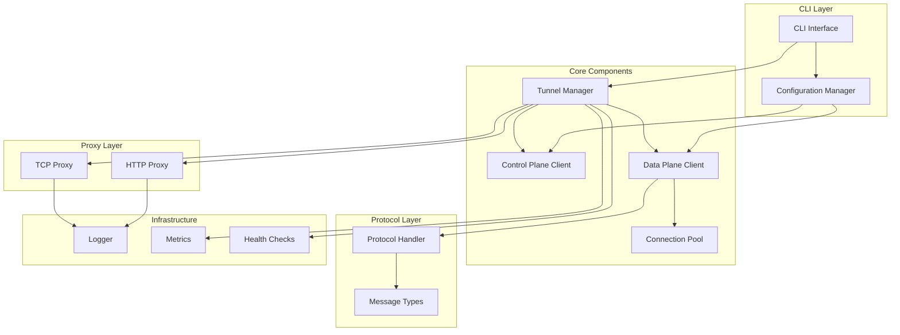
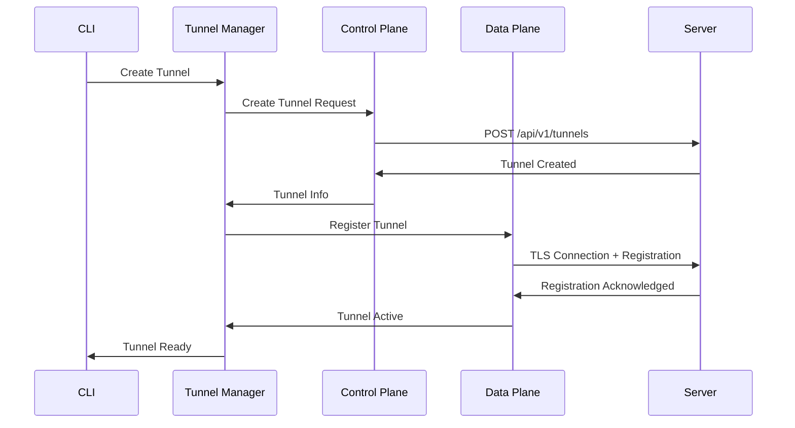
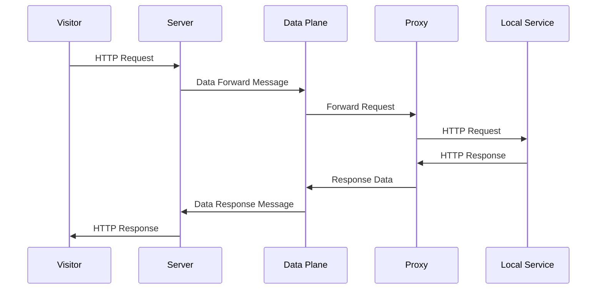

# ShipIt Client Daemon - Architecture Document

## Overview

This document defines the architecture and design decisions for the ShipIt client daemon, a Go application that connects to the ShipIt server to expose local services to the internet.

## Architecture Principles

1. **Separation of Concerns**: Clear separation between control plane (HTTP API) and data plane (TLS protocol)
2. **Modularity**: Each component has a well-defined interface and responsibility
3. **Reliability**: Built-in retry logic, connection pooling, and graceful degradation
4. **Security**: TLS everywhere, secure credential storage, input validation
5. **Observability**: Comprehensive logging, metrics, and health checks
6. **Cross-Platform**: Native support for macOS, Linux, and Windows

## Technology Stack Decisions

### Core Technologies
- **Language**: Go 1.21+ (for modern features and performance)
- **HTTP Client**: Standard `net/http` with custom retry logic
- **TLS**: Standard `crypto/tls` for data plane connections
- **CLI Framework**: [Cobra](https://github.com/spf13/cobra) for command-line interface
- **Configuration**: [Viper](https://github.com/spf13/viper) for YAML/JSON configuration
- **Logging**: [Logrus](https://github.com/sirupsen/logrus) for structured logging
- **Daemonization**: [kardianos/service](https://github.com/kardianos/service) for cross-platform service management
- **Testing**: [testify](https://github.com/stretchr/testify) for assertions and mocking

### Security Technologies
- **Credential Storage**: [99designs/keyring](https://github.com/99designs/keyring) for secure API key storage
- **Certificate Validation**: Standard Go TLS with custom certificate validation
- **Input Validation**: Custom validation with [go-playground/validator](https://github.com/go-playground/validator)

### Monitoring Technologies
- **Metrics**: [Prometheus client](https://github.com/prometheus/client_golang) for metrics collection
- **Health Checks**: Custom health check endpoint
- **Performance**: Built-in performance monitoring

## Component Architecture



## Component Responsibilities

### CLI Interface (`cmd/client/`)
- **Purpose**: Main entry point and command-line interface
- **Responsibilities**:
  - Parse command-line arguments
  - Initialize configuration
  - Start/stop daemon
  - Manage tunnels
  - Handle configuration commands

### Configuration Manager (`internal/config/`)
- **Purpose**: Load and validate configuration
- **Responsibilities**:
  - Load YAML configuration files
  - Handle environment variable overrides
  - Validate configuration
  - Provide default values
  - Manage secure credential storage

### Tunnel Manager (`internal/client/tunnel_manager.go`)
- **Purpose**: Orchestrate tunnel lifecycle
- **Responsibilities**:
  - Create and manage tunnels
  - Handle tunnel registration
  - Manage reconnection logic
  - Coordinate between control and data planes
  - Handle graceful shutdown

### Control Plane Client (`internal/client/control_plane.go`)
- **Purpose**: HTTP API communication with server
- **Responsibilities**:
  - Authenticate with server
  - Create/delete tunnels
  - List tunnel status
  - Handle API errors and retries
  - Manage authentication tokens

### Data Plane Client (`internal/client/data_plane.go`)
- **Purpose**: TLS protocol communication with server
- **Responsibilities**:
  - Establish TLS connections
  - Handle binary protocol messages
  - Manage connection pool
  - Forward traffic to local services
  - Handle connection failures

### Connection Pool (`internal/client/connection_pool.go`)
- **Purpose**: Manage multiple TLS connections
- **Responsibilities**:
  - Maintain connection pool
  - Load balance connections
  - Monitor connection health
  - Clean up dead connections
  - Provide connection statistics

### Protocol Handler (`internal/protocol/`)
- **Purpose**: Handle binary protocol messages
- **Responsibilities**:
  - Serialize/deserialize messages
  - Validate message format
  - Handle protocol errors
  - Manage message routing

### Proxy Implementations (`internal/proxy/`)
- **Purpose**: Forward traffic to local services
- **Responsibilities**:
  - HTTP request/response forwarding
  - TCP connection forwarding
  - Header manipulation
  - Error handling
  - Connection tracking

## Data Flow

### Tunnel Creation Flow


### Data Forwarding Flow


## Configuration Structure

```yaml
server:
  domain: "your-shipit-server.com"
  api_port: 443
  data_plane_port: 7223
  tls_verify: true

auth:
  api_key: "shipit_abc123..."
  auto_refresh: true

tunnels:
  - name: "web-app"
    protocol: "http"
    local_port: 3000
    subdomain: "myapp"
    auto_start: true

connection:
  pool_size: 10
  heartbeat_interval: 30s
  reconnect_interval: 5s
  max_reconnect_attempts: 10

logging:
  level: "info"
  format: "json"
  file: "/var/log/shipit-client.log"
```

## Security Considerations

### Authentication
- API keys stored securely using system keyring
- TLS certificate validation for all connections
- No credentials in configuration files

### Network Security
- All communications over TLS
- Certificate pinning for server validation
- Connection timeouts and rate limiting

### Input Validation
- All user inputs validated
- Configuration file validation
- Protocol message validation

## Performance Considerations

### Connection Management
- Connection pooling for high throughput
- Load balancing across connections
- Automatic connection health monitoring

### Memory Management
- Efficient message serialization
- Connection cleanup on shutdown
- Memory leak prevention

### Monitoring
- Prometheus metrics for performance tracking
- Health check endpoints
- Structured logging for debugging

## Error Handling Strategy

### Error Types
1. **Authentication Errors**: Exit with clear error message
2. **Network Errors**: Retry with exponential backoff
3. **Protocol Errors**: Close connection and reconnect
4. **Configuration Errors**: Validate and provide helpful messages

### Recovery Mechanisms
- Automatic reconnection with backoff
- Graceful degradation of features
- Clear error reporting to users
- Health check monitoring

## Deployment Considerations

### Cross-Platform Support
- **macOS**: launchd service, Homebrew formula
- **Linux**: systemd service, .deb/.rpm packages
- **Windows**: Windows service, installer

### Installation Methods
- Binary downloads
- Package managers (Homebrew, apt, yum)
- Docker containers
- Manual installation scripts

## Testing Strategy

### Unit Testing
- All components unit tested
- Mock implementations for external dependencies
- Coverage targets: 80%+

### Integration Testing
- End-to-end tunnel testing
- Server integration testing
- Cross-platform testing

### Performance Testing
- Load testing with concurrent connections
- Memory usage testing
- Network failure simulation

## Monitoring and Observability

### Metrics
- Connection count and health
- Request/response rates
- Error rates and types
- Memory and CPU usage

### Logging
- Structured JSON logging
- Request ID tracking
- Performance logging
- Security event logging

### Health Checks
- Service health endpoint
- Connection health monitoring
- Configuration validation
- Dependency health checks

## Future Considerations

### Scalability
- Support for multiple tunnels
- Load balancing across servers
- Horizontal scaling capabilities

### Features
- WebSocket support
- Custom domain support
- Advanced routing rules
- Plugin architecture

### Integration
- Kubernetes operator
- Terraform provider
- CI/CD integration
- Monitoring integration (Prometheus, Grafana) 